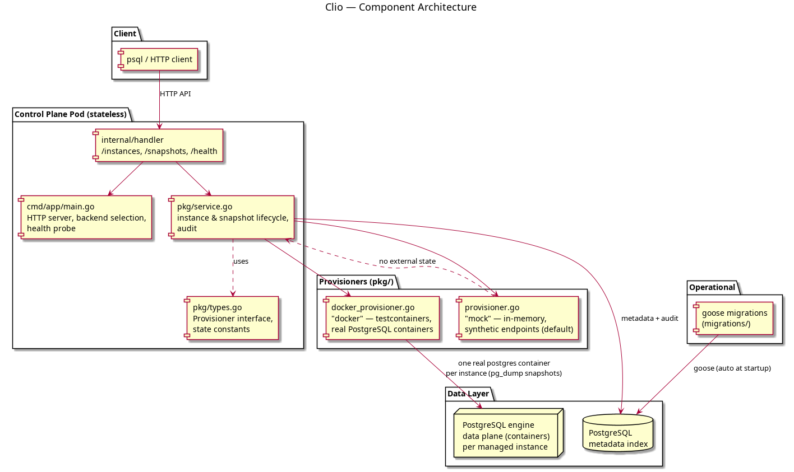

# Clio

The **managed relational database** service for the Olympus platform — an
RDS-equivalent control plane written in Go. Named after the muse of history,
who records everything: every managed database instance, its point-in-time
snapshots, and the full state history are chronicled here.

Clio manages the control plane (state, metadata, lifecycle) while a pluggable
**`Provisioner`** acts as the data plane. A mock provisioner ships with the
service so the full API runs locally with zero databases; select the real
`docker` provisioner to launch **actual PostgreSQL containers for every managed
instance** (via a Docker daemon), the way RDS runs real engines.

Tenancy mirrors the rest of the platform: `accounts` → `projects` → resources.

## Architecture

```
cmd/app/main.go              HTTP server, health probe, goose migrations on startup
internal/handler/            HTTP handlers (/instances, /snapshots, ...)
pkg/
  ├── service.go             Control plane: instance & snapshot lifecycle, audit
  ├── provisioner.go         Mock data plane (in-memory, synthetic endpoints)
  ├── docker_provisioner.go  Real data plane (real PostgreSQL containers via Docker)
  ├── types.go               Provisioner interface + state constants
  └── database/              Postgres client + goose migration runner
migrations/                  goose SQL migrations (applied automatically at startup)
tests/integration/           testcontainers-backed tests (Postgres, and real engines)
```



## Running locally

Boot Postgres (host `15436`), then the service (listening on `:8087`):

```bash
make up
make run
```

Smoke test (mock provisioner):

```bash
# tenant project
curl -X POST localhost:8087/projects -H 'X-Account-Id: acme' -H 'Content-Type: application/json' \
     -d '{"name":"prod"}'

# catalogs
curl localhost:8087/engines
curl localhost:8087/instance-sizes

# create a managed database instance
curl -X POST localhost:8087/instances -H 'X-Account-Id: acme' -H 'Content-Type: application/json' \
     -d '{"project":"prod","name":"analytics","engine":"postgres","engine_version":"16.8","size":"clio-small"}'

# stop/start and snapshot
curl -X POST localhost:8087/instance/prod/analytics/stop -H 'X-Account-Id: acme'
curl -X POST localhost:8087/instance/prod/analytics/start -H 'X-Account-Id: acme'
curl -X POST localhost:8087/snapshots -H 'X-Account-Id: acme' -H 'Content-Type: application/json' \
     -d '{"project":"prod","instance":"analytics","name":"pre-deploy"}'

curl localhost:8087/health    # {"status":"healthy","postgres":"ok","provisioner":"ok"}
```

On shutdown: `make down`.

## Real databases (PROVISIONER=docker)

Point Clio at a Docker daemon and every managed instance becomes a real,
reachable PostgreSQL container:

```bash
PROVISIONER=docker \
  POSTGRES_DSN='host=localhost port=15436 user=olympus password=olympus_secret dbname=olympus_databases sslmode=disable' \
  ./clio
```

Each managed instance is a dedicated PostgreSQL container with a generated
master password returned **once** at creation. The endpoint returned by Clio is
the container's real mapped `host:port` — you can point `psql` at it and work
with actual data. Snapshots are real logical backups taken with `pg_dump` from
inside the instance container.

## Endpoints

| Method | Path                                   | Purpose                                        |
|--------|----------------------------------------|------------------------------------------------|
| POST   | `/projects`, `GET /projects`           | Create / list tenant project namespaces        |
| GET    | `/engines`                             | Supported database engines/versions            |
| GET    | `/instance-sizes`                      | Database instance-size catalog                 |
| POST   | `/instances`                           | Create a managed database instance             |
| GET    | `/instances?project={p}`               | List instances in a project                    |
| GET    | `/instance/{p}/{name}`                 | Instance details (endpoint + master username)  |
| POST   | `/instance/{p}/{name}/start`           | Resume a stopped instance                      |
| POST   | `/instance/{p}/{name}/stop`            | Pause a running instance                       |
| DELETE | `/instance/{p}/{name}`                 | Delete an instance                             |
| POST   | `/snapshots`                           | Take a point-in-time snapshot of an instance   |
| GET    | `/snapshots?project={p}&instance={i}`  | List an instance's snapshots                   |
| DELETE | `/snapshot/{p}/{i}/{name}`             | Delete a snapshot                              |
| GET    | `/health`                              | Postgres + provisioner connectivity            |

All requests carry tenants via the `X-Account-Id` header (defaults to `default`).

## Provisioner abstraction

`pkg.Provisioner` is the data-plane contract (`CreateInstance`,
`DeleteInstance`, `StartInstance`, `StopInstance`, `CreateSnapshot`,
`DeleteSnapshot`, `Healthy`). Two implementations ship:

- **`mock`** (default) — in-memory, synthetic endpoints, so the whole control
  plane runs with no database engine at all.
- **`docker`** — real provisioning via testcontainers against a local Docker
  daemon: every managed instance is an actual PostgreSQL container, and
  snapshots are real `pg_dump` backups.

Swap in another backend (Aurora/RDS, a managed MySQL fleet, a home-grown
engine) behind the same interface; the control plane never talks to a database
engine directly.

## Tests

```bash
make fmt && make vet
make test      # unit tests
make test-it   # integration tests (testcontainers Postgres; needs Docker)
RUN_DOCKER_TESTS=1 go test -v ./tests/integration/ -run TestDockerProvisionerRealDatabases  # live engines
```

The `TestDockerProvisionerRealDatabases` test boots real PostgreSQL containers
and writes/reads through them over the network, proving the data plane is real.

## Database migrations

Migrations are managed with [goose](https://github.com/pressly/goose), applied
automatically at startup. The schema covers accounts, projects, database
engines (seeded), instance sizes (seeded), database instances, snapshots, and
an audit log.

```bash
goose -dir migrations create add_column sql
```