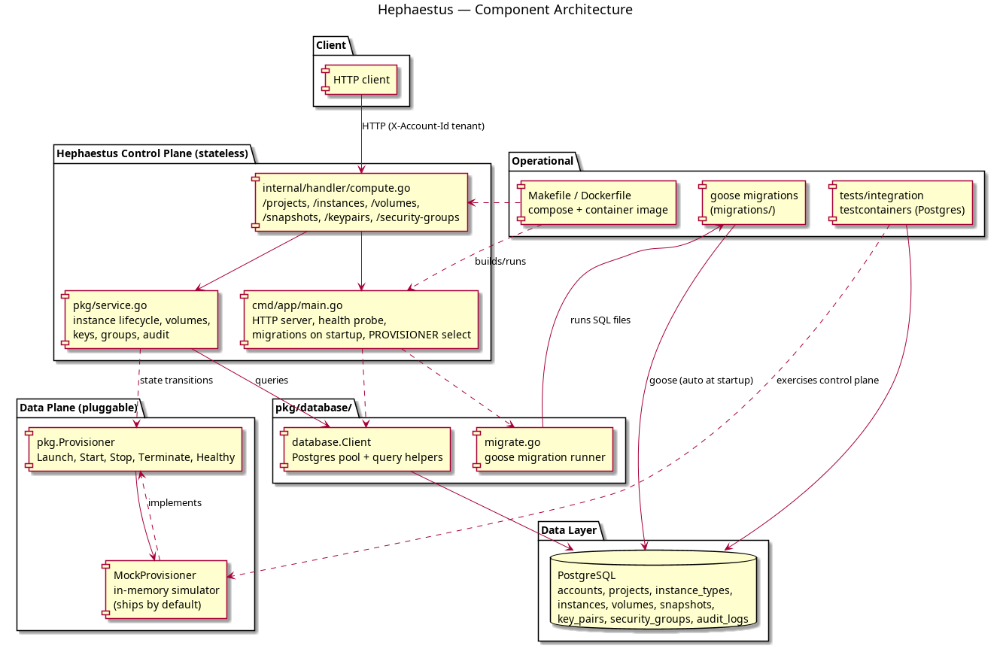

# Hephaestus

The **compute** service for the Olympus platform — an EC2-equivalent control
plane written in Go. Named after the Greek god of the forge: instances are
"forged" compute, launched at various sizes, powered by attached volumes, and
secured with key pairs and security-group rules.

Hephaestus manages the control plane (state, metadata, lifecycle) while a
pluggable **`Provisioner`** acts as the data plane. A mock provisioner ships
with the service so the full API can run locally with zero hypervisor; swap in
a real backend (QEMU, Firecracker, cloud API) behind the same interface.

Tenancy mirrors the rest of the platform: `accounts` → `projects` → resources.

## Architecture

```
cmd/app/main.go              HTTP server, health probe, goose migrations on startup
internal/handler/            HTTP handlers (/instances, /volumes, /snapshots, ...)
pkg/
  ├── service.go             Control plane: lifecycle, volumes, keys, groups, audit
  ├── provisioner.go         Mock data plane (Launch/Start/Stop/Terminate/Healthy)
  ├── types.go               Provisioner interface + instance state constants
  └── database/              Postgres client + goose migration runner
migrations/                  goose SQL migrations (applied automatically at startup)
tests/integration/           testcontainers-backed tests (Postgres)
```



## Running locally

Boot Postgres (host `15434`), then the service (listening on `:8084`):

```bash
make up
make run
```

Smoke test:

```bash
# tenant project + SSH key pair (private key is shown once)
curl -X POST localhost:8084/projects -H 'X-Account-Id: acme' -H 'Content-Type: application/json' \
     -d '{"name":"prod"}'
curl -X POST localhost:8084/keypairs -H 'X-Account-Id: acme' -H 'Content-Type: application/json' \
     -d '{"project":"prod","name":"deploy"}'

# catalog + launch
curl localhost:8084/types
curl -X POST localhost:8084/instances -H 'X-Account-Id: acme' -H 'Content-Type: application/json' \
     -d '{"project":"prod","name":"web-1","type":"olympus-small","key_pair":"deploy"}'

# lifecycle
curl -X POST localhost:8084/instance/prod/web-1/stop
curl -X POST localhost:8084/instance/prod/web-1/start
curl -X POST localhost:8084/instance/prod/web-1/terminate

# volumes, snapshots, security groups
curl -X POST localhost:8084/volumes -H 'X-Account-Id: acme' -H 'Content-Type: application/json' \
     -d '{"project":"prod","name":"data","size_gb":10}'
curl 'localhost:8084/snapshots?project=prod'
curl -X POST localhost:8084/security-groups -H 'X-Account-Id: acme' -H 'Content-Type: application/json' \
     -d '{"project":"prod","name":"web","rules":[{"port":443,"cidr":"0.0.0.0/0"}]}'

curl localhost:8084/health    # {"status":"healthy","postgres":"ok","provisioner":"ok"}
```

On shutdown: `make down`.

## Endpoints

| Method | Path                              | Purpose                                          |
|--------|-----------------------------------|--------------------------------------------------|
| POST   | `/projects`, `GET /projects`      | Create / list tenant project namespaces          |
| GET    | `/types`                          | Instance-type catalog                            |
| POST   | `/instances`                      | Launch an instance                               |
| GET    | `/instances?project={p}`          | List instances in a project                      |
| GET    | `/instance/{p}/{name}`            | Instance details                                 |
| POST   | `/instance/{p}/{name}/start|stop|terminate` | Lifecycle transitions                     |
| DELETE | `/instance/{p}/{name}`            | Terminate an instance                            |
| POST   | `/keypairs`, `GET /keypairs/{p}`  | Create (private key shown once) / list key pairs |
| POST   | `/security-groups`, `GET /security-groups/{p}` | Manage rulesets                  |
| POST   | `/volumes`, `GET /volumes?project={p}`, `DELETE /volume/{p}/{name}` | Block storage |
| POST   | `/snapshots`, `GET /snapshots?project={p}` | Volume backups                          |
| GET    | `/health`                         | Postgres + provisioner connectivity              |

All requests carry tenants via the `X-Account-Id` header (defaults to `default`).

## Provisioner abstraction

`pkg.Provisioner` is the data-plane contract (`Launch`, `Start`, `Stop`,
`Terminate`, `Healthy`). The default `mock` provisioner tracks instances in
memory and synthesizes private IPs, so the whole control plane works locally.
A real backend simply implements the interface and is selected via the
`PROVISIONER` env var — the control plane never talks to a hypervisor directly.

## Tests

```bash
make fmt && make vet
make test      # unit tests
make test-it   # integration tests (testcontainers Postgres; needs Docker)
```

## Database migrations

Migrations are managed with [goose](https://github.com/pressly/goose), applied
automatically at startup. The schema covers accounts, projects, instance types
(seeded), instances, volumes, snapshots, key pairs, security groups, and an
audit log.

```bash
goose -dir migrations create add_column sql
```