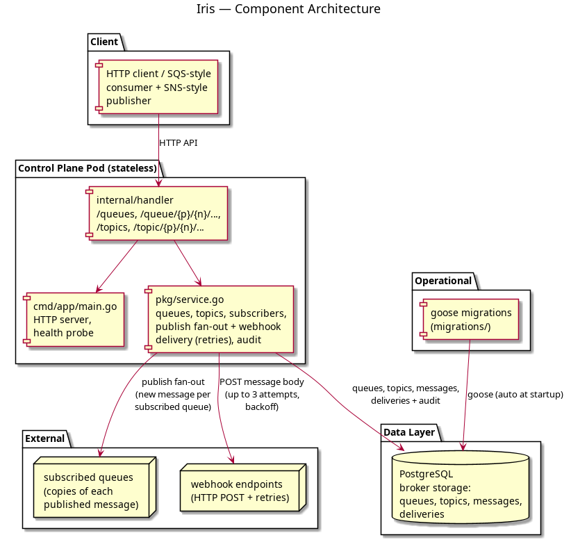

# Iris

The **managed messaging and pub-sub** service for the Olympus platform — an
SQS + SNS-equivalent built in Go. Named after the goddess of the rainbow, the
herald of the gods who carried news across the span of the sky: messages
fan out from Iris's topics to curious queues and far-flung webhook endpoints.

Iris hosts SQS-style **queues** (poll with visibility timeouts, ack on receipt,
retention-based expiry) and SNS-style **topics** (publish once, delivered many).
A topic's **subscribers** are queues — each publish is fanned out into a fresh
message per subscribed queue — and **webhook URLs**, which receive a real HTTP
`POST` of the message body with automatic retries.

Iris is the broker itself: queues, topics, and messages live in Postgres, so
published messages survive restarts and there is no separate provisioner or
extra infrastructure to run.

Tenancy mirrors the rest of the platform: `accounts` → `projects` → resources.

## Architecture

```
cmd/app/main.go              HTTP server, health probe, goose migrations on startup
internal/handler/            HTTP handlers (/queues, /queue/{p}/{n}/..., ...)
pkg/
  ├── service.go             Broker: queues, topics, subscribers, publish fan-out,
  │                          webhook delivery with retries, audit
  └── database/              Postgres client + goose migration runner
migrations/                  goose SQL migrations (applied automatically at startup)
tests/integration/           testcontainers-backed tests (Postgres)
```



## Running locally

Boot Postgres (host `15438`), then the service (listening on `:8089`):

```bash
make up
make run
```

Smoke test:

```bash
# tenant project
curl -X POST localhost:8089/projects -H 'X-Account-Id: acme' -H 'Content-Type: application/json' \
     -d '{"name":"prod"}'

# queues: create, send, poll (visibility), ack
curl -X POST localhost:8089/queues -H 'X-Account-Id: acme' -H 'Content-Type: application/json' \
     -d '{"project":"prod","name":"jobs"}'
curl -X POST localhost:8089/queue/prod/jobs/send -H 'X-Account-Id: acme' -H 'Content-Type: application/json' \
     -d '{"body":"build #42","attributes":{"type":"ci"}}'
curl -X POST localhost:8089/queue/prod/jobs/poll -H 'X-Account-Id: acme'
curl -X POST localhost:8089/queue/prod/jobs/ack -H 'X-Account-Id: acme' -H 'Content-Type: application/json' \
     -d '{"message_id":"<id from poll>"}'

# topics: subscribe a queue, subscribe a webhook, publish
curl -X POST localhost:8089/topics -H 'X-Account-Id: acme' -H 'Content-Type: application/json' \
     -d '{"project":"prod","name":"events"}'
curl -X POST localhost:8089/topic/prod/events/subscribe -H 'X-Account-Id: acme' -H 'Content-Type: application/json' \
     -d '{"queue_name":"jobs"}'
curl -X POST localhost:8089/topic/prod/events/subscribe -H 'X-Account-Id: acme' -H 'Content-Type: application/json' \
     -d '{"webhook_url":"https://example.com/hooks/iris"}'
curl -X POST localhost:8089/topic/prod/events/publish -H 'X-Account-Id: acme' -H 'Content-Type: application/json' \
     -d '{"body":"user signed up"}'

# the webhook URL received a real POST; the queue now holds a copy
curl -X POST localhost:8089/queue/prod/jobs/poll -H 'X-Account-Id: acme'

curl localhost:8089/health    # {"status":"healthy","postgres":"ok"}
```

On shutdown: `make down`.

## Endpoints

| Method | Path                                | Purpose                                      |
|--------|-------------------------------------|----------------------------------------------|
| POST   | `/projects`, `GET /projects`        | Create / list tenant project namespaces      |
| POST   | `/queues`                           | Create an SQS-style queue                    |
| GET    | `/queues?project={p}`               | List queues in a project                     |
| GET    | `/queue/{p}/{name}`                 | Queue details                                |
| DELETE | `/queue/{p}/{name}`                 | Delete a queue (cascades its subscribers)    |
| POST   | `/queue/{p}/{name}/send`            | Enqueue a message (`body`, optional `attributes`) |
| POST   | `/queue/{p}/{name}/poll`            | Pull up to 10 visible messages (marks `in_flight`) |
| POST   | `/queue/{p}/{name}/ack`             | Acknowledge (remove) a delivered message     |
| POST   | `/topics`                           | Create an SNS-style topic                    |
| GET    | `/topics?project={p}`               | List topics in a project                     |
| GET    | `/topic/{p}/{name}`                 | Topic details                                |
| DELETE | `/topic/{p}/{name}`                 | Delete a topic (cascades subscribers)        |
| POST   | `/topic/{p}/{name}/publish`         | Fan a message out to every subscriber        |
| POST   | `/topic/{p}/{name}/subscribe`       | Attach a `queue_name` or `webhook_url`       |
| GET    | `/topic/{p}/{name}/subscribers`     | List a topic's subscribers                   |
| POST   | `/topic/{p}/{name}/unsubscribe`     | Detach a subscriber by `subscriber_id`       |
| GET    | `/health`                           | Postgres connectivity                        |

All requests carry tenants via the `X-Account-Id` header (defaults to `default`).

## Message semantics

- **Visibility**: `send` inserts a message with `visible_at = now`. `poll`
  locks eligible messages (`pending` and visible) as `in_flight` for the
  queue's `visibility_timeout_sec` (default 30). An unacked message becomes
  visible to other consumers once its window lapses.
- **Retention**: each message carries `expires_at = now + message_retention_sec`
  (default 86 400, one day); expired messages are purged.
- **Fan-out**: `publish` inserts a fresh message into every subscribed queue —
  copies are independent, each with its own lifecycle.
- **Webhooks**: publish records a `webhook_deliveries` row per webhook
  subscriber and POSTs the message body (`application/json`, body raw) with up
  to 3 attempts and exponential backoff; `status` and `last_error` are recorded
  after each attempt.

## Tests

```bash
make fmt && make vet
make test      # unit tests
make test-it   # integration tests (testcontainers Postgres; needs Docker)
```

The integration suite covers queue lifecycle, visibility-timeout re-exposure,
topic fan-out to multiple queues, webhook delivery (success and retry-on-
failure) against an `httptest` receiver, tenant isolation, and the HTTP +
audit path.

## Database migrations

Migrations are managed with [goose](https://github.com/pressly/goose), applied
automatically at startup. The schema covers accounts, projects, queues,
queue messages, topics, topic subscribers (queue or webhook kinds), webhook
delivery history, and an audit log.

```bash
goose -dir migrations create add_column sql
```