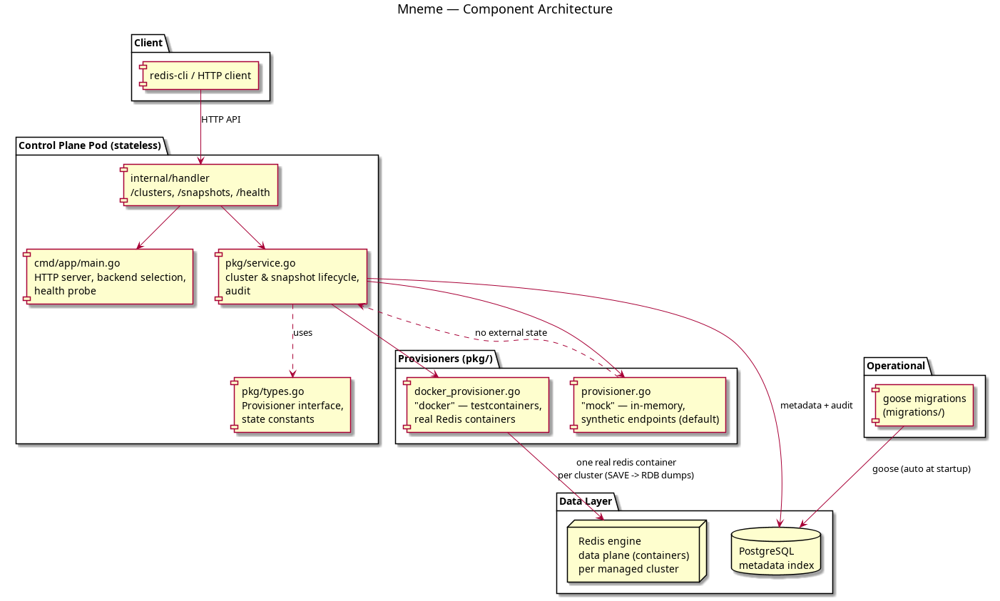

# Mneme

The **managed in-memory caching** service for the Olympus platform — an
ElastiCache-equivalent control plane written in Go. Named after the muse of
memory, the keeper of the mnemonic arts: cache clusters that hold your hot
data, and the point-in-time snapshots that remember every state, are counted
among her works.

Mneme manages the control plane (state, metadata, lifecycle) while a pluggable
**`Provisioner`** acts as the data plane. A mock provisioner ships with the
service so the full API runs locally with zero caches; select the real
`docker` provisioner to launch **actual Redis containers for every managed
cluster** (via a Docker daemon), the way ElastiCache runs real Redis.

Tenancy mirrors the rest of the platform: `accounts` → `projects` → resources.

## Architecture

```
cmd/app/main.go              HTTP server, health probe, goose migrations on startup
internal/handler/            HTTP handlers (/clusters, /snapshots, ...)
pkg/
  ├── service.go             Control plane: cluster & snapshot lifecycle, audit
  ├── provisioner.go         Mock data plane (in-memory, synthetic endpoints)
  ├── docker_provisioner.go  Real data plane (real Redis containers via Docker)
  ├── types.go               Provisioner interface + state constants
  └── database/              Postgres client + goose migration runner
migrations/                  goose SQL migrations (applied automatically at startup)
tests/integration/           testcontainers-backed tests (Postgres, and real engines)
```



## Running locally

Boot Postgres (host `15437`), then the service (listening on `:8088`):

```bash
make up
make run
```

Smoke test (mock provisioner):

```bash
# tenant project
curl -X POST localhost:8088/projects -H 'X-Account-Id: acme' -H 'Content-Type: application/json' \
     -d '{"name":"prod"}'

# catalogs
curl localhost:8088/engines
curl localhost:8088/node-types

# create a managed cache cluster
curl -X POST localhost:8088/clusters -H 'X-Account-Id: acme' -H 'Content-Type: application/json' \
     -d '{"project":"prod","name":"session-cache","engine":"redis","engine_version":"7.4","node_type":"mneme-small","num_nodes":2}'

# take a snapshot
curl -X POST localhost:8088/snapshots -H 'X-Account-Id: acme' -H 'Content-Type: application/json' \
     -d '{"project":"prod","cluster":"session-cache","name":"pre-release"}'

curl localhost:8088/health    # {"status":"healthy","postgres":"ok","provisioner":"ok"}
```

On shutdown: `make down`.

## Real Redis (PROVISIONER=docker)

Point Mneme at a Docker daemon and every managed cluster becomes a real,
reachable Redis instance:

```bash
PROVISIONER=docker \
  POSTGRES_DSN='host=localhost port=15437 user=olympus password=olympus_secret dbname=olympus_caches sslmode=disable' \
  ./mneme
```

Each managed cluster is a dedicated Redis container. The endpoint returned by
Mneme is the container's real mapped `host:port` — point `redis-cli` at it and
work with actual keys. Snapshots are real RDB dumps: a `SAVE` is triggered
inside the instance container and the produced `dump.rdb` is streamed out.

## Endpoints

| Method | Path                                   | Purpose                                        |
|--------|----------------------------------------|------------------------------------------------|
| POST   | `/projects`, `GET /projects`           | Create / list tenant project namespaces        |
| GET    | `/engines`                             | Supported cache engines/versions               |
| GET    | `/node-types`                          | Cache node-type catalog                        |
| POST   | `/clusters`                            | Create a managed cache cluster                 |
| GET    | `/clusters?project={p}`                | List clusters in a project                     |
| GET    | `/cluster/{p}/{name}`                  | Cluster details (endpoint)                     |
| DELETE | `/cluster/{p}/{name}`                  | Delete a cluster                               |
| POST   | `/snapshots`                           | Take a point-in-time snapshot of a cluster     |
| GET    | `/snapshots?project={p}&cluster={c}`   | List a cluster's snapshots                     |
| DELETE | `/snapshot/{p}/{c}/{name}`             | Delete a snapshot                              |
| GET    | `/health`                              | Postgres + provisioner connectivity            |

All requests carry tenants via the `X-Account-Id` header (defaults to `default`).

## Provisioner abstraction

`pkg.Provisioner` is the data-plane contract (`CreateCluster`,
`DeleteCluster`, `CreateSnapshot`, `DeleteSnapshot`, `Healthy`). Two
implementations ship:

- **`mock`** (default) — in-memory, synthetic endpoints, so the whole control
  plane runs with no cache engine at all.
- **`docker`** — real provisioning via testcontainers against a local Docker
  daemon: every managed cluster is an actual Redis container, and snapshots
  are real RDB dumps (`SAVE` → `dump.rdb`).

Swap in another backend (ElastiCache, a Memcached fleet, a home-grown cache
cluster) behind the same interface; the control plane never talks to a cache
engine directly.

## Tests

```bash
make fmt && make vet
make test      # unit tests
make test-it   # integration tests (testcontainers Postgres; needs Docker)
RUN_DOCKER_TESTS=1 go test -v ./tests/integration/ -run TestDockerProvisionerRealRedis  # live engines
```

The `TestDockerProvisionerRealRedis` test boots a real Redis container and
`SET`/`GET`s keys through it over the network, proving the data plane is real.

## Database migrations

Migrations are managed with [goose](https://github.com/pressly/goose), applied
automatically at startup. The schema covers accounts, projects, cache engines
(seeded), node types (seeded), cache clusters, snapshots, and an audit log.

```bash
goose -dir migrations create add_column sql
```