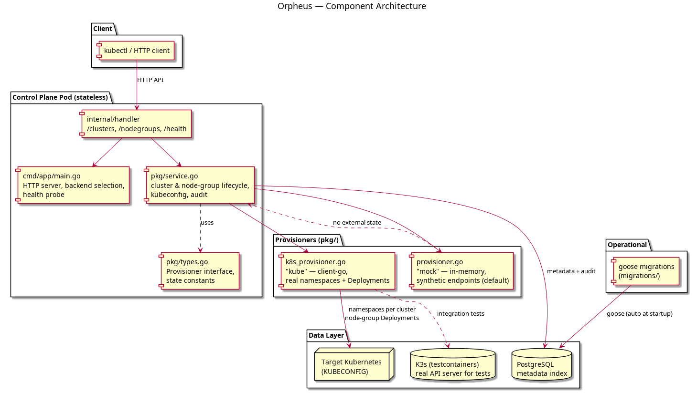

# Orpheus

The **managed Kubernetes** service for the Olympus platform — an EKS-equivalent
control plane written in Go. Named after the mythical musician who orchestrated
order out of chaos: clusters, worker node groups, and kubeconfigs are
"conducted" here.

Orpheus manages the control plane (state, metadata, lifecycle) while a pluggable
**`Provisioner`** acts as the data plane. A mock provisioner ships with the
service so the full API runs locally with zero Kubernetes; select the real
`kube` provisioner to provision **actual namespaces and node-group Deployments
through a live Kubernetes API** (via `KUBECONFIG`), the way EKS manages real
clusters.

Tenancy mirrors the rest of the platform: `accounts` → `projects` → resources.

## Architecture

```
cmd/app/main.go              HTTP server, health probe, goose migrations on startup
internal/handler/            HTTP handlers (/clusters, /nodegroups, ...)
pkg/
  ├── service.go             Control plane: cluster & node-group lifecycle, audit
  ├── provisioner.go         Mock data plane (in-memory, synthetic endpoints)
  ├── k8s_provisioner.go     Real data plane (client-go: namespaces + Deployments)
  ├── kubeconfig.go          kubeconfig document renderer
  ├── types.go               Provisioner interface + state constants
  └── database/              Postgres client + goose migration runner
migrations/                  goose SQL migrations (applied automatically at startup)
tests/integration/           testcontainers-backed tests (Postgres, and K3s)
```



## Running locally

Boot Postgres (host `15435`), then the service (listening on `:8086`):

```bash
make up
make run
```

Smoke test (mock provisioner):

```bash
# tenant project
curl -X POST localhost:8086/projects -H 'X-Account-Id: acme' -H 'Content-Type: application/json' \
     -d '{"name":"prod"}'

# catalogs
curl localhost:8086/versions
curl localhost:8086/node-sizes

# create a managed cluster, then a worker node group
curl -X POST localhost:8086/clusters -H 'X-Account-Id: acme' -H 'Content-Type: application/json' \
     -d '{"project":"prod","name":"eks-prod","kubernetes_version":"1.30"}'
curl -X POST localhost:8086/nodegroups -H 'X-Account-Id: acme' -H 'Content-Type: application/json' \
     -d '{"project":"prod","cluster":"eks-prod","name":"workers","node_size":"olympus-small","min_size":1,"desired_size":2,"max_size":4}'

# scale the node group, then grab a kubeconfig
curl -X POST localhost:8086/nodegroup/prod/eks-prod/workers/scale -H 'X-Account-Id: acme' \
     -H 'Content-Type: application/json' -d '{"desired_size":3}'
curl localhost:8086/cluster/prod/eks-prod/kubeconfig -H 'X-Account-Id: acme'

curl localhost:8086/health    # {"status":"healthy","postgres":"ok","provisioner":"ok"}
```

On shutdown: `make down`.

## Real Kubernetes (PROVISIONER=kube)

Point Orpheus at a live Kubernetes API server and it provisions real resources:

```bash
export ORPHEUS_KUBECONFIG=~/.kube/config   # target cluster
make run BUILD_ARGS="../../orpheus ..."   # or run the binary directly
```

point the env at the binary:

```bash
PROVISIONER=kube ORPHEUS_KUBECONFIG=~/.kube/config \
  POSTGRES_DSN='host=localhost port=15435 user=olympus password=olympus_secret dbname=olympus_orchestration sslmode=disable' \
  ./orpheus
```

Every managed "cluster" becomes a dedicated `or-{name}` namespace on the target
cluster; each node group becomes a `ng-{name}` Deployment whose replica count is
the desired node count. Scale through Orpheus scales the Deployment via the real
API, and the generated kubeconfig points at the target cluster's API server with
its real CA.

## Endpoints

| Method | Path                              | Purpose                                          |
|--------|-----------------------------------|--------------------------------------------------|
| POST   | `/projects`, `GET /projects`      | Create / list tenant project namespaces          |
| GET    | `/versions`                       | Supported Kubernetes control-plane versions      |
| GET    | `/node-sizes`                     | Worker node-size catalog                         |
| POST   | `/clusters`                       | Create a managed cluster                         |
| GET    | `/clusters?project={p}`           | List clusters in a project                       |
| GET    | `/cluster/{p}/{name}`             | Cluster details                                  |
| GET    | `/cluster/{p}/{name}/kubeconfig`  | Rendered kubeconfig (YAML)                       |
| DELETE | `/cluster/{p}/{name}`             | Delete a cluster                                 |
| POST   | `/nodegroups`                     | Attach a worker node group                       |
| GET    | `/nodegroups?project={p}&cluster={c}` | List node groups                             |
| POST   | `/nodegroup/{p}/{c}/{name}/scale` | Resize a node group (min/max bounded)            |
| DELETE | `/nodegroup/{p}/{c}/{name}`       | Remove a node group                              |
| GET    | `/health`                         | Postgres + provisioner connectivity              |

All requests carry tenants via the `X-Account-Id` header (defaults to `default`).

## Provisioner abstraction

`pkg.Provisioner` is the data-plane contract (`CreateCluster`, `DeleteCluster`,
`CreateNodeGroup`, `ScaleNodeGroup`, `DeleteNodeGroup`, `Healthy`). Two
implementations ship:

- **`mock`** (default) — in-memory, synthetic API endpoints and mock CA data, so
  the whole control plane runs with no Kubernetes at all.
- **`kube`** — real provisioning via client-go against the target cluster in
  `ORPHEUS_KUBECONFIG`: namespaces, node-group Deployments, real scaling, and
  real CA material in generated kubeconfigs.

Swap in another backend (EKS, a home-grown control plane) behind the same
interface; the control plane never talks to Kubernetes directly.

## Tests

```bash
make fmt && make vet
make test      # unit tests
make test-it   # integration tests (testcontainers Postgres; needs Docker)
RUN_K8S_TESTS=1 go test -v ./tests/integration/ -run TestKubeProvisionerRealK3s  # live K3s
```

The `TestKubeProvisionerRealK3s` test boots a real K3s container and provisions
clusters/node groups through its actual Kubernetes API.

## Database migrations

Migrations are managed with [goose](https://github.com/pressly/goose), applied
automatically at startup. The schema covers accounts, projects, Kubernetes
versions (seeded), node sizes (seeded), clusters, node groups, and an audit log.

```bash
goose -dir migrations create add_column sql
```