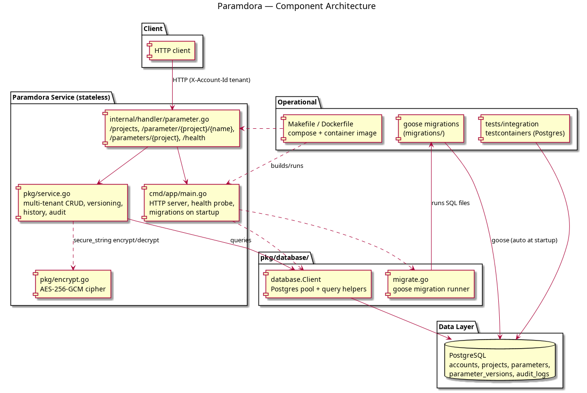

# Paramdora

Multi-tenant, S3-style Parameter Store for the Olympus platform, written in Go.
Paramdora keeps named parameters (plain strings, string lists, and AES-256-GCM
encrypted secure strings) in a Postgres metadata layer with full version history,
so values can be created, updated, listed, and audited per tenant.

Just like OlympusStore, tenancy is modelled as `accounts` → `projects` → `parameters`:

- **accounts** – tenants; each request is scoped by the `X-Account-Id` header.
- **projects** – named namespaces inside an account (e.g. `checkout-api`, `orders-svc`).
- **parameters** – versioned key/value entries with a type and optional tags.
- **parameter_versions** – immutable history of every value change.
- **audit_logs** – audit trail of create/get/update/delete/list operations.

## Architecture

```
cmd/app/main.go              HTTP server, health probe, goose migrations on startup
internal/handler/            HTTP handlers (/parameter, /parameters, /projects, /health)
pkg/
  ├── service.go             Business logic: multi-tenant CRUD, versioning, history
  ├── encrypt.go             AES-256-GCM cipher for secure_string values
  └── database/              Postgres client + goose migration runner
migrations/                  goose SQL migrations (applied automatically at startup)
tests/integration/           testcontainers-backed tests (Postgres)
```



## Running locally

Boot Postgres (host `15433`), then the service (listening on `:8083`):

```bash
make up
make run
```

Smoke test:

```bash
# create a tenant project
curl -X POST localhost:8083/projects -H 'X-Account-Id: acme' \
     -H 'Content-Type: application/json' \
     -d '{"name":"checkout-api","description":"checkout service config"}'

# put / update a plain parameter (version bumps on every put)
curl -X PUT localhost:8083/parameter/checkout-api/db/host \
     -H 'X-Account-Id: acme' -H 'Content-Type: application/json' \
     -d '{"value":"db1.internal","type":"string"}'

# read it back (value masked unless ?decrypt=true for secure_string)
curl -i localhost:8083/parameter/checkout-api/db/host -H 'X-Account-Id: acme'

# list with a prefix
curl 'localhost:8083/parameters/checkout-api?prefix=db/' -H 'X-Account-Id: acme'

# full version history
curl 'localhost:8083/parameter/checkout-api/db/host?history=true' -H 'X-Account-Id: acme'

# secret that is encrypted at rest — readable only with ?decrypt=true
curl -X PUT localhost:8083/parameter/checkout-api/db/password \
     -H 'X-Account-Id: acme' -H 'Content-Type: application/json' \
     -d '{"value":"s3cr3t!","type":"secure_string"}'
curl 'localhost:8083/parameter/checkout-api/db/password?decrypt=true' -H 'X-Account-Id: acme'

curl localhost:8083/health                     # {"status":"healthy","postgres":"ok"}
```

On app shutdown: `make down`.

## Endpoints

| Method | Path                              | Purpose                                    |
|--------|-----------------------------------|--------------------------------------------|
| POST   | `/projects`                       | Create a project namespace for the account |
| GET    | `/projects`                       | List the account's projects                |
| PUT    | `/parameter/{project}/{name}`     | Create or update a parameter               |
| GET    | `/parameter/{project}/{name}`     | Read a parameter (`?decrypt=true`, `?history=true`) |
| DELETE | `/parameter/{project}/{name}`     | Delete a parameter and its history         |
| GET    | `/parameters/{project}`           | List parameters (`?prefix=app/db/`)        |
| GET    | `/health`                         | Postgres connectivity probe                |

All requests carry tenants via the `X-Account-Id` header (defaults to `default`).

## Tests

```bash
make fmt && make vet
make test            # unit tests
make test-it         # integration tests (testcontainers Postgres; needs Docker)
```

## Database migrations

Migrations are managed with [goose](https://github.com/pressly/goose) and applied
automatically at service startup. Add one with:

```bash
goose -dir migrations create add_column sql
```

## Deployment

Set the master key used for `secure_string` encryption before starting (a random
one-shot key is used if omitted, making stored secrets unreadable after restart):

```bash
export PARAMDORA_MASTER_KEY='change-me'
go run ./cmd/app           # or the container image
```