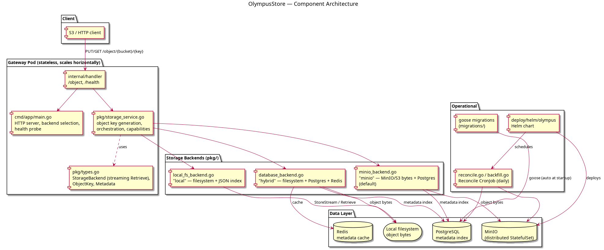

# OlympusStore

An on-premise, S3-compatible object storage service written in Go. OlympusStore
streams object data with efficient handling of large files, keeps a Postgres
metadata index with SHA-256 ETags, and stores the actual bytes in MinIO (or the
local filesystem). The gateway pods are stateless, so they scale out horizontally
behind a single S3-compatible endpoint.

## Architecture



```
cmd/app/main.go          HTTP server entry point, backend selection, health probe
internal/handler/        HTTP handlers (/object, /health)
pkg/
  ├── types.go           StorageBackend interface (streaming Retrieve), Metadata
  ├── storage_service.go Business logic (object key generation, capabilities)
  ├── local_fs_backend.go   "local"  backend – filesystem + JSON index
  ├── database_backend.go   "hybrid" backend – filesystem + Postgres + Redis
  ├── minio_backend.go      "minio" backend – MinIO/S3 bytes + Postgres metadata
  ├── reconcile.go          orphan / missing / ETag-drift reconciliation
  └── backfill.go           one-time x-olympus-etag metadata backfill
internal/handler/        HTTP handlers
migrations/              goose SQL migrations (run automatically at startup)
deploy/helm/olympus/     Helm chart (gateway + distributed MinIO + reconcile CronJob)
tests/integration/       testcontainers-backed tests (Postgres + Redis + MinIO)
```

### Storage backends

The active backend is selected with `STORAGE_BACKEND`:

| Backend  | Bytes        | Metadata        | Notes                                  |
| -------- | ------------ | --------------- | -------------------------------------- |
| `local`  | filesystem   | JSON meta files | Zero dependencies, single node         |
| `hybrid` | filesystem   | Postgres + Redis| Metadata index + cache                 |
| `minio`  | MinIO / S3   | Postgres        | Stateless gateways, scale-out (default)|

Every upload streams to a temp file while computing a SHA-256 ETag, then commits
metadata so the DB and MinIO stay in sync. Content is served back as a seekable
stream via `http.ServeContent` (range requests, no full-buffer in memory).

### Object keys

Keys are generated as `bucket/originalName[:versionId]`, defaulting to version
`LATEST`.

## Prerequisites

- Go 1.23+
- Docker (for the compose stack and integration tests)

## Running locally

Boot the compose stack (Postgres on host `15432`, Redis `16379`, MinIO `9000/9001`):

```bash
make up
```

Then start the gateway against it (listening on `:8080`):

```bash
make run
```

The first PUT automatically provisions its bucket space, so a quick smoke test is:

```bash
curl -X PUT localhost:8080/object/demo/hello.txt \
     -H 'X-Object-Filename: hello.txt' \
     --data-binary 'hello olympus'

curl -i localhost:8080/object/demo/hello.txt   # returns the bytes + ETag
curl localhost:8080/health                     # {"status":"healthy",...}
```

Stop the stack when done:

```bash
make down
```

| Target             | Purpose                                                       |
|--------------------|--------------------------------------------------------------|
| `make up` / `down` | Start / stop the docker-compose stack                        |
| `make run`         | Run the gateway with `STORAGE_BACKEND=minio` on `:8080`      |
| `make build`       | Compile the `olympus-store` binary                           |
| `make docker-build`| Build the gateway container image                            |
| `make reconcile`   | Reconciliation report only (no changes)                      |
| `make reconcile-repair` | Reconcile + mark missing rows + fix ETag drift         |
| `make backfill-etag`    | Stamp `x-olympus-etag` on pre-existing MinIO objects |

Run `make` (or `make help`) for the full list.

## Running the tests

```bash
# Formatting / static checks
make fmt
make vet

# Unit tests (cmd/app)
make test            # or: go test ./cmd/app/...

# Integration tests (boots Postgres + Redis + MinIO via testcontainers; needs Docker)
make test-it         # or: go test -v ./tests/integration/...
```

The integration suite applies the goose migrations and exercises the hybrid and
MinIO backends end-to-end, including reconciliation of orphaned/drifted objects.

## Database migrations

Migrations are managed with [goose](https://github.com/pressly/goose) and are
applied automatically at startup. Add a new schema change with:

```bash
goose -dir migrations create add_columns sql
```

And apply or roll back with:

```bash
goose -dir migrations postgres "host=localhost port=15432 dbname=olympus_storage user=olympus password=olympus_secret sslmode=disable" up
goose -dir migrations postgres "host=localhost port=15432 dbname=olympus_storage user=olympus password=olympus_secret sslmode=disable" down
```

## Deployment

`deploy/helm/olympus/` deploys the stateless gateway together with a distributed
MinIO StatefulSet and a scheduled reconcile `CronJob`:

```bash
helm lint deploy/helm/olympus
helm install olympus deploy/helm/olympus --namespace olympus --create-namespace
```

See the `goose`-driven `migrations/` for the schema, and `specs/` for design
notes on replication and scaling.

## Design docs

- `specs/STORAGE_WORKER_REPLICATION.md` – distributed MinIO arrangement, quorum,
  self-healing and scaling.
- `DB_COMPARISON.md` – why Postgres + Redis/metadata alongside object storage.
- `IMPLEMENTATION_PLAN.md` – phased build plan.